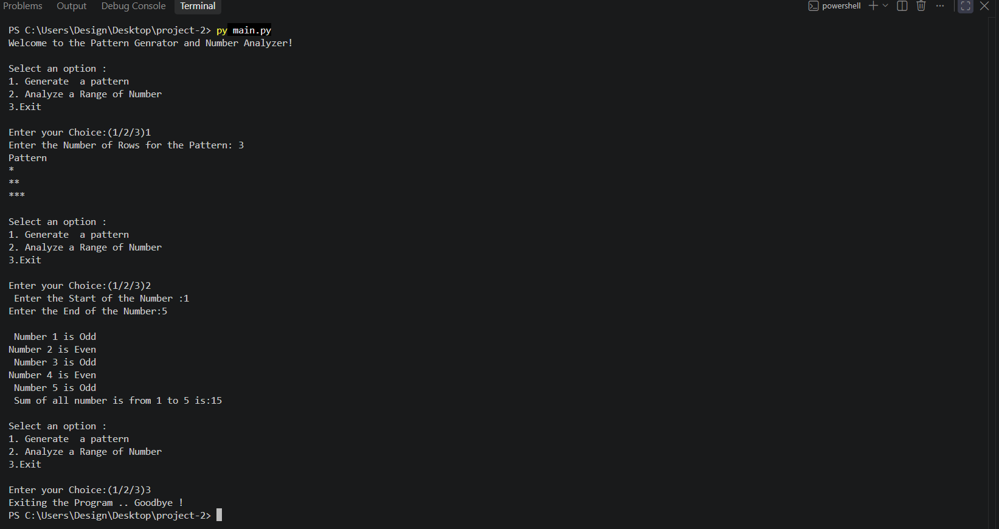

# Pattern Generator and Number Analyzer

A simple Python console program that allows users to **generate star patterns** and **analyze a range of numbers**. The program uses a menu-driven interface and continues running until the user chooses to exit.

## Features

* ⭐ Generate a right-angled star pattern.
* 🔢 Analyze numbers within a specified range.
* ✅ Identify whether each number is even or odd.
* ➕ Calculate the sum of all numbers in the given range.
* 🚪 Exit the program through the menu.
* 🔄 Continuously runs until the user selects the exit option.

## Requirements

* Python 3.x
* No external libraries are required.

## Project Structure

```text

├── main.py
├── output.png
├── README.md
```
## output


## How to Run

1. Make sure Python 3.x is installed on your computer.
2. Clone or download this project.
3. Open a terminal in the project folder.
4. Run the following command:

```bash
python pattern_generator.py
```

On some systems, use:

```bash
python3 pattern_generator.py
```

## How to Use

When the program starts, you will see:

```text
Welcome to the Pattern Genrator and Number Analyzer!

Select an option :
1. Generate a pattern
2. Analyze a Range of Number
3. Exit
```

### Option 1 — Generate a Pattern

Enter the number of rows.

Example:

```text
Enter the Number of Rows for the Pattern: 5

Pattern
*
**
***
****
*****
```

### Option 2 — Analyze a Range of Numbers

Enter the starting and ending numbers.

Example:

```text
Enter the Start of the Number: 1
Enter the End of the Number: 5

Number 1 is Odd
Number 2 is Even
Number 3 is Odd
Number 4 is Even
Number 5 is Odd

Sum of all number is from 1 to 5 is:15
```

### Option 3 — Exit

Selecting option `3` exits the program:

```text
Exiting the Program .. Goodbye !
```

## Program Structure

The program uses basic Python programming concepts:

### 1. `while` Loop

The `while True` loop continuously displays the menu until the user selects option `3`.

### 2. `if-elif-else`

Conditional statements are used to handle the three menu options:

```python
if choice == 1:
    # Generate pattern
elif choice == 2:
    # Analyze numbers
elif choice == 3:
    # Exit program
else:
    # Invalid choice
```

### 3. `for` Loop

A `for` loop is used to generate the star pattern:

```python
for i in range(1, num + 1):
    print("*" * i)
```

Another `for` loop is used to analyze each number in the selected range.

### 4. Even and Odd Number Checking

The modulo operator `%` is used to determine whether a number is even or odd:

```python
if i % 2 == 0:
    print(f"Number {i} is Even")
else:
    print(f"Number {i} is Odd")
```

### 5. Sum Calculation

The program calculates the total of all numbers in the selected range:

```python
total = total + i
```

## Program Flow

```text
Start
  │
  ▼
Display Welcome Message
  │
  ▼
Display Menu
  │
  ▼
Get User Choice
  │
  ├──► Choice 1 ──► Generate Star Pattern
  │                       │
  │                       ▼
  │                   Display Pattern
  │                       │
  │                       └────► Back to Menu
  │
  ├──► Choice 2 ──► Enter Number Range
  │                       │
  │                       ▼
  │                  Check Even/Odd
  │                       │
  │                       ▼
  │                   Calculate Sum
  │                       │
  │                       └────► Back to Menu
  │
  ├──► Choice 3 ──► Exit Program
  │
  └──► Invalid Choice ──► Display Error
                              │
                              └────► Back to Menu
```

## Future Improvements

* Add input validation.
* Handle invalid number ranges.
* Add different types of patterns.
* Find the largest and smallest number in a range.
* Calculate the average of numbers.
* Improve the user interface.

## Author

**Your Name**

## License

This project is created for learning and educational purposes.
